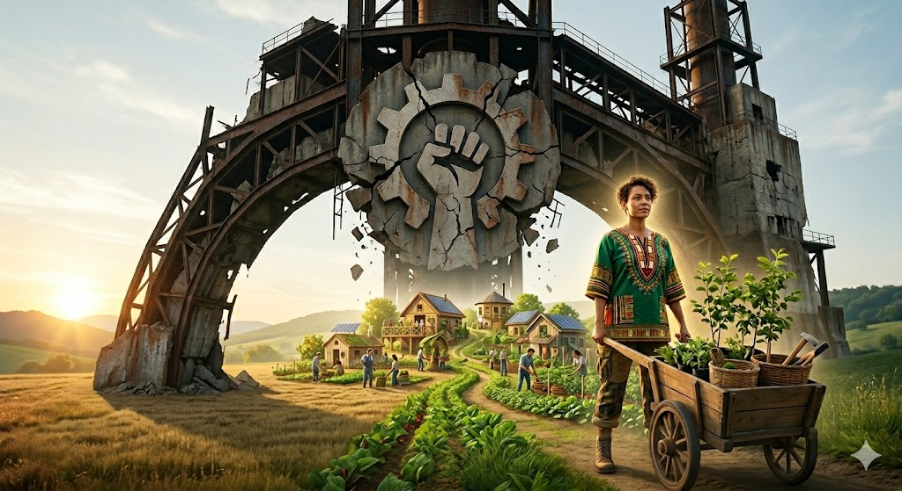

## Kapital versus föderale Systeme

### Die Ausgangslage: Kapital sucht Zusagen, nicht Innovation
In Sektoren der Grundversorgung (Energie, Wärme, Wasser) folgen Inventionen nicht Nachhaltigkeit oder der libertären Marktlogik eines Peter Thiel. Es geht nicht um das „bessere Produkt“, sondern um einen **risikofreien Cashflow**.
* **Der Investitions-Pakt:** Investitionen erfolgen nur dort, wo Politik und Kapital eine Interessengemeinschaft eingehen. Abnahmegarantien und die Sicherung der Produktionsauslastung sind harte Währungen, die über Zeiträume von 30 bis 50Jahren – weit über die steuerliche Abschreibung hinaus – stabil bleiben sollen.
* **Beschäftigung als Geiselhaft:** Die schiere Masse an Arbeitsplätzen wird instrumentell eingesetzt, um Investitionen gegen regulatorische Änderungen abzusichern. In diesem Modell ist „Nachhaltigkeit“ ein nachrangiger Compliance-Faktor, keine primäre Zielgröße.

### Das Risiko: Die Innovationsfalle
Diese Form der Absicherung führt zwangsläufig zu Abhängigkeiten. Das System wird starr, da jede Gefährdung (durch effizientere oder dezentralere Technologien) die Rentabilität der abgesicherten Bestandsanlagen gefährdet. Das Kapital kämpft hier aktiv gegen den Fortschritt, um die Abschreibungszyklen und CashCow-Phase nicht zu stören.

### Die Lösung: Föderation als neues Sicherheitsmodell
Zentralisierte Ansätze müssen gelöst werden. Die **Föderation** (dezentrale PV-Anlagen, Speicher, Lastmanagement) bietet dafür ein überlegenes ökonomisches Sicherheitsmodell:
1. **Demokratisierung von Kapital:** Das Investitionsrisiko wird atomisiert. Tausende private Akteure investieren in eigene Assets (Speicher/PV), deren Absicherung nicht durch staatliche Garantien, sondern durch unmittelbare Eigenverbrauchs-Vorteile erfolgt.
2. **Systemische Resilienz:** Während Großkraftwerke „Too big to fail“ sind, wäre die Föderation „Too many to fail“. Ein dezentrales Netz ist aufgrund seiner Struktur immun gegen die ökonomischen Schocks, die ein zentralisiertes System bei technologischem oder politischen Wandel in den Abgrund reißen.
3. **Software- statt Hardware-Rendite:** Während klassisches Kapital auf den Erhalt des Status Quo setzt, generiert die Föderation Wertschöpfung durch digitale Optimierung (Arbitrage, Regelleistung) und ständige Anpassungsfähigkeit.

### Strategischer Ansatz
Die Politik muss den Fokus von der Absicherung von **Einzelinvestoren** hin zur Ermöglichung von **Marktteilhabe**verschieben. Resilienz entsteht nicht durch staatlich garantierte Auslastung alter Strukturen, sondern durch die Förderung eines föderalen Verbunds, der technologisch und finanziell auf tausenden Säulen steht. 
