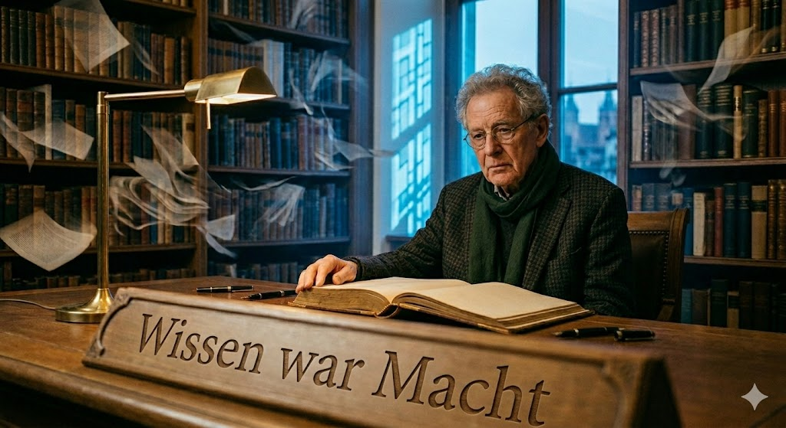

## Wissen war Macht

Heideggers *Gestell*, Arendts *Animal Laborans*, die Warnung, dass die eigentliche Bedrohung nicht darin liegt, dass Maschinen wie Menschen denken, sondern dass Menschen beginnen, wie Maschinen zu denken — all das sind Chiffren für dasselbe Phänomen: die KI verändert nicht nur, was Menschen tun, sondern wer sie sind.
Eine der greifbarsten Verschiebungen betrifft das Wissen. Was einmal Kapital war — erlernt, erarbeitet, exklusiv — ist heute Commodity. Agenten vermitteln jeden dokumentierten Aspekt der Welt, direkt und kontextgenau, und befähigen den Anwender zu Aufgaben, die bisher Spezialisten vorbehalten waren. Die Hierarchie, die auf Wissen gründete, erodiert. Wissen differenziert nicht mehr.
Was bleibt dem Menschen als Grundlage von Führung und Handlung? Sicher nicht der Wettbewerb mit der Maschine auf ihrer eigenen Ebene. Der Maschinenraum ist kein menschlicher Raum. Operative Exzellenz der Maschine kann keine Zielsetzung für menschliches Handeln sein.
Was sich ableiten lässt, kommt aus der Herkunft des Menschen: Intentionalität, Urteilsvermögen, ethische Grundlagen, ein Glaube, der keine Institutionen braucht, Philosophie und Mystik als Orientierung jenseits des Messbaren. Der Mensch führt nicht, indem er wie eine Maschine arbeitet, denkt oder optimiert — sondern indem er Ziele setzt, die keine Maschine haben kann.
Maschinen wollen funktionieren. Menschen wollen überleben, lieben, bedeuten. Das ist der Unterschied — und er ist fundamental.
